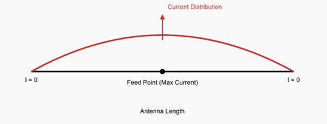
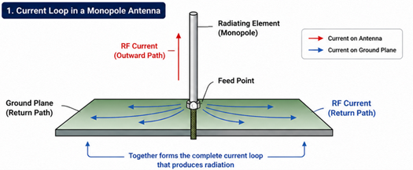
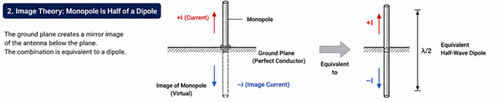
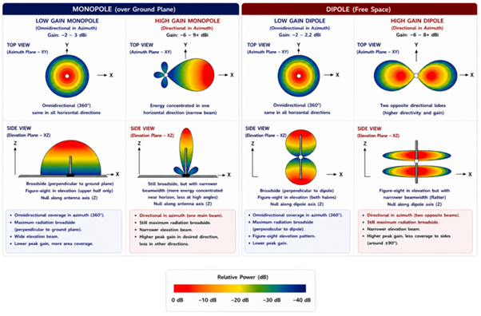

## Executive Summary

Wireless communication does not occur simply because signals exist inside a circuit.  
It occurs only when energy leaves a device, propagates through space and is captured elsewhere in a useful form.

The antenna is the structure that enables this transition.

Inside a system/device, signals exist as voltages and currents. These are confined to conductors and internal components. They do not naturally propagate through space.

The antenna converts electrical energy into electromagnetic waves and performs the reverse process at the receiver.

In modern wireless systems, from IoT devices to 4G and 5G networks, antenna behaviour determines:

- Range

- Reliability

- Power efficiency

- Link robustness

While modulation, coding and protocols are often emphasized, **the antenna ultimately governs how a system interacts with the physical world**.

**Key insight:** Communication is not just signal processing. It is energy transfer through space.

## From Circuits to Space

Inside a device, signals are electrical. They exist as currents and voltages moving through electronic components and conductors.

Wireless communication requires something fundamentally different; energy must detach from the conductor and propagate through space. In other words, energy transitions from guided form to radiated electromagnetic waves.

This transition happens at the antenna.

When current oscillates in an antenna:

- It creates time-varying electric and magnetic fields

- These fields propagate outward as electromagnetic waves

- A receiver antenna captures part of this energy and converts it back into current

This defines the communication chain:

- Energy leaves the circuit

- Propagates through space

- Is captured and converted back

If this transfer is inefficient, no amount of signal processing can compensate. This is because communication depends on energy transfer, not just signal generation.

## The Constraint That Governs Everything: Wavelength

Every antenna is governed by the wavelength of the signal to be transmitted or received. Wavelength is defined as

$$\lambda = \frac{c}{f}$$

where:  
λ = wavelength  
c = speed of light  
f = frequency

Wavelength determines how electromagnetic fields vary in space and how current is distributed along the antenna. For an antenna to radiate efficiently, the current must follow this spatial variation. This happens when the antenna is resonant.

In a simple wire antenna (dipole), current forms a standing wave, meaning:

- Maximum at the feed point

- Decreases toward the ends

- Zero at the open ends

This standing wave occurs when the antenna is resonant, which happens at specific fractions of the wavelength.

{width="5.642877296587926in" height="2.1518700787401577in"}

This standing wave enables efficient radiation by allowing energy to be transferred into space. A half-wave dipole has a length of approximately λ/2. A monopole antenna is half of a dipole, using the ground plane as the other half. Therefore, the monopole length is approximately λ/4.

This is why many practical antennas are designed around quarter-wavelength dimensions.

An antenna much longer than λ/4 can still radiate but will exhibit more complex current distributions and radiation patterns.

Typical quarter-wave antenna sizes of cellular bands:

- 700 MHz → \~10 cm

- 900 MHz → \~8 cm

- 2.4 GHz → \~3 cm

- 3.5 GHz → \~2 cm

This leads to a fundamental challenge:

Devices are small. Wavelengths are not.

This mismatch drives almost every antenna design trade-off.

**Key** **Insight**: Antenna size is dictated by wavelength and wavelength is set by physics.

## The Antenna Is Not a Component. It Is a System

The most common antenna in IoT devices is the monopole. It appears to be a single conductor, but in reality, it is only half the antenna. **The other half is the ground plane**.

A monopole is electrically half of a dipole. The ground plane completes the other half.

{width="5.555811461067367in" height="2.2996358267716537in"}

As shown above, the radiating element together with the ground plane forms the complete current path that enables electromagnetic radiation.

{width="7.472077865266842in" height="1.5257086614173228in"}

As shown above, the ground plane acts as a mirror, creating an image of the monopole below it.  The real antenna and its image together form an equivalent half-wave dipole. As a result, a quarter-wave monopole radiates like a dipole, but only into half-space.

**Key** **Insight**: The ground plane completes the antenna; it is not optional.

When current flows through the antenna element, it must return through the ground plane. Together, they form the complete radiating system.

The antenna element alone does not radiate effectively. Radiation occurs because of this current loop:

- Current flows up the antenna

- Returns through the ground plane

- Forms a complete electromagnetic system

Radiation is produced by the complete current loop, not just the visible antenna element. The ground plane is not optional. It determines:

- Impedance

- Radiation efficiency

- Radiation pattern

In real devices:

- The PCB acts as the ground plane

- The antenna includes the PCB, enclosure and nearby components

This has important implications:

- The antenna is not a separate component

- PCB size, shape and layout directly affect performance

- Changes to layout, components or enclosure change the antenna

A well-designed antenna on a poor ground plane will underperform. A simple antenna on a good ground plane can perform well.

**Key Insight**: The antenna is not just the element; it is the current loop.

## The Small Antenna Problem

When an antenna is much smaller than λ/4, it becomes electrically short.

This leads to:

- Capacitive behaviour

- Low radiation resistance

- Poor efficiency

- Narrow bandwidth

Instead of radiating energy, the antenna:

- Stores energy in near fields

- Reflects power back to the transmitter

In effect, the antenna behaves more like a reactive element than an efficient radiator.

The efficiency of the antenna is given by:

$$\eta = \frac{R_{r}}{R_{r} + R_{loss}}$$

where:

$R_{r}$ = radiation resistance

$R_{loss}$ = loss resistance

For compact antennas:

- Radiation resistance is very small

- Loss resistance becomes comparable

As a result, much of the energy is lost as heat rather than being radiated. This limitation leads to a key question: how can physically small antennas be made to resonate?

## Electrical Lengthening: The Role of Loading

Small antennas do not radiate efficiently because they are shorter than the wavelength required for resonance.

To make them usable, engineers use loading.

A loading coil introduces inductance into the antenna. This inductance cancels the capacitive behaviour of a short antenna and allows it to resonate.

As a result, a physically short antenna behaves as if it were electrically longer.

This means:

- The antenna can support a standing wave

- Radiation becomes possible

- Efficiency improves compared to an un-loaded short antenna

However, loading does not eliminate the fundamental limitations of small antennas.

The antenna still:

- Has lower efficiency than a full-length antenna

- Exhibits narrower bandwidth

- Is more sensitive to manufacturing tolerances and environment

### Loading Configurations

Different loading strategies distribute current differently along the antenna:

- Base loading → simplest, but least efficient

- Center loading → improves current distribution and efficiency

- Top loading → best performance, but more difficult to implement

**What Loading Does and Does Not Do**

Loading enables a short antenna to reach resonance, but it does not make it equivalent to a full-length antenna.

- It improves radiation compared to a very short antenna

- It does not increase performance beyond a properly sized antenna

- Losses in the coil and conductor remain

**Key Insight:** Compact antennas can be made to work through loading, but this comes at the cost of efficiency and bandwidth.

This raises a further challenge; how can a single antenna operate efficiently across multiple frequencies?

## Multi-Band Antennas

Modern devices must support multiple bands:

- Low-band cellular (700--900 MHz)

- Mid-band cellular (1--2.6 GHz)

- Wi-Fi / Bluetooth (2.4 GHz)

- 5G mid-band (\~3.5 GHz)

A single antenna structure cannot naturally resonate at all these frequencies. Instead, the antenna is designed to support multiple resonant modes.

Even in a monopole antenna, which appears to be a single conductor, the current distribution along its length is not uniform and varies with frequency. At each frequency, different portions of the antenna carry most of the current and contribute to radiation.

This behaviour is achieved through structural design:

- Variations in geometry (such as loading coils or sections of different diameter) alter how current flows along the antenna

- Inductive loading changes the phase of current along the structure, enabling resonance at lower frequencies

- The structure supports multiple standing wave patterns along its length

As frequency changes:

- At lower frequencies, current is distributed over a larger portion of the antenna

- At higher frequencies, current is concentrated in shorter sections

- The effective electrical length changes with frequency

- The radiation behaviour changes accordingly

As a result, a single monopole structure can operate across multiple frequency bands by supporting different current distributions at different frequencies.

**Key Insight**: A multi-band antenna is not a single resonance; it is multiple resonant behaviours within the same structure.

### Why Multiple Resonances Exist

Resonance occurs when the antenna length supports a standing wave. For a simple conductor, this happens when its electrical length satisfies:

$$\ L ≈ n · (λ/2) $$

where:

L = effective electrical length

λ = wavelength

n = 1, 2, 3, ... (mode number)

For n = 1:

- Fundamental mode ( λ/2 for dipole, λ/4 for monopole)

For higher values of n:

- The same structure can support additional standing wave patterns

- Each pattern corresponds to a different resonant frequency

This means a single antenna can resonate at multiple frequencies, each associated with a different current distribution along its length.

In practical antennas, loading and geometry modify these conditions, allowing resonances to be shifted and controlled across desired frequency bands.

An intuitive way to understand this is to think of a vibrating string. The same string can vibrate in multiple modes:

- The fundamental tone

- Higher harmonics

Each mode has a different shape and frequency.

Similarly, an antenna supports multiple standing wave patterns along its length, each corresponding to a different resonant frequency.

### How Geometry Controls Resonance

In practical monopole antennas, resonance is not determined by length alone. It is shaped by how current flows along the structure.

Two key design elements are used to control this:

- Loading coils introduce inductance, which cancels the capacitive behaviour of a short antenna. This allows resonance to occur at lower frequencies without increasing physical length.

- Changes in diameter or thickness affect how current is distributed. Thicker sections tend to support broader current distribution, which improves bandwidth and reduces sensitivity to small variations.

Together, these features modify the effective electrical length and impedance of the antenna.

This allows the same physical structure to support multiple resonant conditions across different frequencies.

## Gain: What It Really Means

Antennas do not create power. They redistribute it.

- Low gain → energy spread over a wide angle

- High gain → energy concentrated in a narrow direction

Gain is focusing, not amplification. A higher-gain antenna increases signal strength in a particular direction by concentrating energy, but this comes at the cost of reduced coverage elsewhere.

{width="6.268055555555556in" height="4.128472222222222in"}

**Why High Gain Can Be Problematic**

High gain can be beneficial, but often performs poorly in typical IoT deployments:

- Devices are randomly oriented

- Beam alignment cannot be guaranteed

- Narrow beams reduce spatial coverage

- Performance becomes sensitive to placement and environment

As a result, high-gain antennas trade coverage for directionality, which can reduce robustness in real-world conditions.

**In Practice**

- Low-gain, omnidirectional antennas are typically used on devices

- Higher-gain antennas are used where orientation and placement are controlled

**An Intuitive View: The Torch Analogy**

A simple way to understand gain is to think of a torch (flashlight).

The same torch can produce:

- A wide beam → light spreads out over a large area

- A narrow beam → light is concentrated in one direction

The total power of the torch does not change. Only how that energy is distributed in space changes.

Antennas behave in the same way:

- Low-gain antennas spread energy in many directions

- High-gain antennas concentrate energy in specific directions

A focused beam appears stronger in one direction, but only because energy has been redistributed, not increased.

**Impact on Multipath and MIMO**

In many wireless systems, especially in urban environments, signals reach the receiver through multiple paths. This multipath propagation can be beneficial:

- It provides diversity, improving reliability

- It enables techniques such as MIMO, which use multiple paths to increase data rate

High-gain antennas, by concentrating energy into a narrow direction, can reduce the number of usable paths. As a result:

- Multipath diversity is reduced

- MIMO performance can degrade

- System performance becomes more dependent on precise alignment

In contrast, low-gain antennas capture energy from many directions, making them more robust in rich multipath environments.

**Common Omnidirectional Antennas**

A useful reference is the gain of common omnidirectional antennas.

A half-wave dipole has a gain of approximately **2.15 dBi**. Its radiation pattern spreads energy in all directions perpendicular to the antenna.

A quarter-wave monopole, when used with a ground plane, radiates only in half-space. The ground plane reflects energy that would otherwise be lost.

As a result, the same transmitted power is concentrated into a smaller region of space, leading to a gain of approximately **5.15 dBi**.

This increase in gain is not due to amplification, but due to redistribution of energy.

In practical systems, the actual gain depends on the quality of the ground plane and the surrounding environment.

**Key Insight**: Gain does not increase total energy; it determines how that energy is distributed in space.

## Aperture of Antenna

An antenna behaves as if it has an effective area over which it captures energy from incoming waves. This is called the effective aperture.

The effective aperture is given by:

$$\ Aₑ = (λ² / 4π) · G $$

where:

Aₑ = effective aperture

λ = wavelength

G = antenna gain

**What the above means**

- Higher gain → larger effective capture area

- Lower frequency (larger wavelength) → larger aperture for the same gain

In other words, antennas that concentrate energy in a direction also capture more energy from that direction.

**Physical Interpretation**

Antenna performance is not just about transmitting power, it is about how effectively energy is transferred through space and captured at the receiver.

A larger effective aperture allows the antenna to intercept more of the incoming electromagnetic energy and convert it into usable signal.

**Impact on System Performance**

Antenna gain and aperture directly affect the link:

- A 3 dB reduction in gain halves the effective aperture

- This reduces the received signal strength

- Link margin decreases accordingly

Even small losses in antenna performance can have a significant impact on communication reliability.

**Connecting Gain and Aperture**

Gain and aperture are two views of the same phenomenon:

- Gain describes how energy is distributed in space

- Aperture describes how much energy is captured

They are linked through wavelength.

**Key Insight**: Antennas determine not just where energy goes, but how much of it can be captured.

## Real-World Mistake: Cable Loss

One of the most overlooked issues in wireless systems is cable loss. The signal between the transmitter and antenna travels through a cable and this cable introduces attenuation.

Typical losses depend on cable type and frequency. For example:

- At 2.4 GHz, \~1--2 dB per meter for common for small diameter coax cables

- Even a 30 cm cable can introduce \~0.5 dB loss

This loss directly reduces system performance:

- Reduced transmit power reaching the antenna

- Reduced signal captured at the receiver

- Lower effective link margin

Cable loss is effectively equivalent to reducing antenna gain. A high-performance antenna can be negated by poor cable choices.

**Key Insight**: Unnecessary cable length reduces system performance.

## Real-World Scenario Where Designs Fail

Even when using external antennas, the antenna is not fully isolated from the system.

The return current flows through the cable shield and the device ground, making them part of the overall radiating system. As a result:

- Poor grounding at the connector can degrade performance

- The cable itself can unintentionally radiate

- The enclosure and nearby components can affect impedance and radiation

An external antenna improves isolation but does not eliminate system interaction. A well-designed antenna can still fail due to poor system integration

## Conclusion

Wireless communication does not occur because signals are generated.

It occurs because:

- Energy leaves the circuit

- Propagates through space

- Is captured and converted back

The antenna determines whether this transfer happens efficiently.

It is not an accessory.  
It is not a component.

**It is where wireless systems succeed or fail.**
